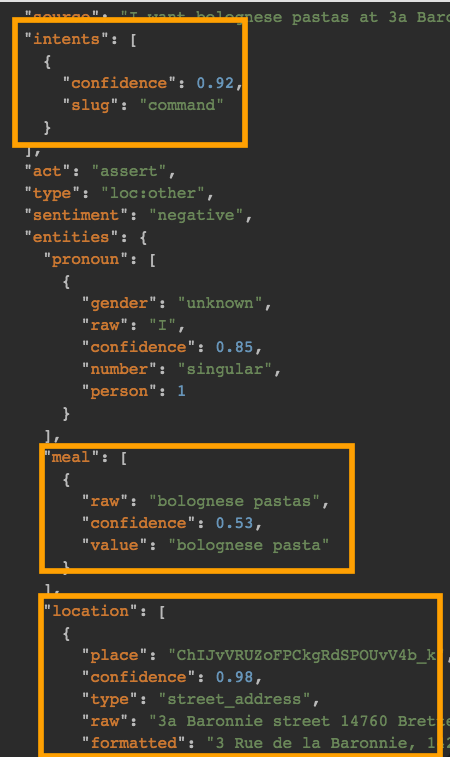

# Use Recast.ai to chat with your Botkit-powered Bot ! 

<p align="center">
	
</p>


This middleware plugin for [Botkit](https://github.com/howdyai/botkit) allows you to seamlessly integrate [Recast.ai](https://recast.ai) natural language intent APIs into your Botkit bot.

You can use the Recast.AI API to analyse your text or your audio file, and extract useful informations from it, to personalize your IoT, classify your data or create bots.

## Requirements

- Create an account on [Recast.ai](https://recast.ai).

## Set up your Recast.AI account

- Log into your Recast.AI account and create a new bot.

Get your token

- In your profile, click your bot.
- In the tab-menu, click on the the little screw.
- Here is the request access token you will need to configure your bot.

## Set up your Botkit based project

- Add botkit-middleware-recastai as a dependency to your Botkit bot :

```npm install --save botkit-middleware-recastai```

- Enable the middleware :
 
```
var RecastaiMiddleware = require('botkit-middleware-recastai')({
        request_token: '322e96b09ef75ad32bfc8b6f22b857ef',
        confidence: 0.4
});

controller.middleware.receive.use(RecastaiMiddleware.receive);

controller.hears(['news'],'message_received', RecastaiMiddleware.hears,function(bot, message) {

 // ...
});
```

## What it does


Using this middleware with Botkit causes every message sent to your bot to be first sent through recast API for processing. The response from recast is then returned in the incoming messages as seen below :

<p align="center">
	
</p>

Using the recast hears middleware tells Botkit to look for Recast intents information, and match using this information instead of the built in pattern matching function.

Have fun coding your bot :)

## License

This project is licensed under the terms of the MIT license. Full license text is available in [LICENSE.md]((LICENSE.md)).   

